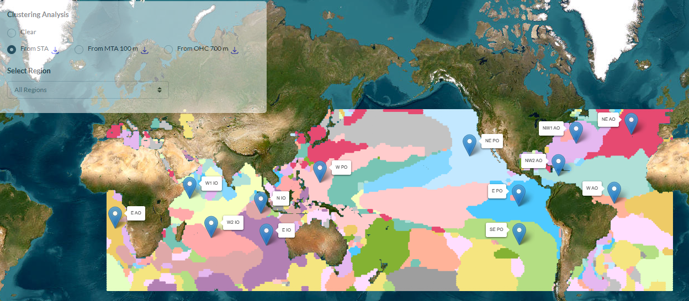

```markdown


# 🌊 Climate Modes ML Explorer

Interactive web-based tool to explore regional climate variability patterns from a multi-layer approach, derived from machine learning models trained on observations.

🔗 **Live tool:** https://cristina-radin.github.io/climate-modes-ml-explorer/  
📄 **Associated publication:** https://link.springer.com/article/10.1007/s41748-024-00409-w  

---

## 📌 Overview

This interactive application translates peer-reviewed scientific results into an explorable and dynamic format.

The tool allows users to:

- Select among different ocean depth layers
- Visualize global climate variability regions
- Explore the spatial structure of each region
- Download all datasets used in the study


---

## 🧠 Scientific Background

The methodology is based on machine learning models trained on observations and climatologies.

Full details of the approach, model architecture and validation are available in the associated publication.

If you use this tool or its underlying methodology, please cite:

> Radin et al. (2024). *Unveiling Regional Climate Patterns Through Global Subsurface Ocean Temperature Data: An AI Multi-Layer Analysis Framework*. Earth System Dynamics.  
> https://doi.org/10.1007/s41748-024-00409-w

---

## 🛠 Technical Stack

- HTML5
- CSS3
- JavaScript

The application runs fully client-side and does not require a backend.

---

## 📂 Project Structure

climate-modes-ml-explorer/
│
├── index.html
├── css/
├── js/
├── data/
├── assets/
└── README.md


🌍 Deployment

The tool is deployed using GitHub Pages and can be accessed directly via the link: https://cristina-radin.github.io/climate-modes-ml-explorer/


🎯 Purpose

Scientific results should not remain static figures in a PDF.

This tool aims to make model outputs accessible, explorable and reusable, encouraging transparency and scientific communication.


📬 Contact

Cristina Radin
University of Hamburg, Hamburg, Germany
cristina.radin@uni-hamburg.de 
https://cristina-radin.github.io/cristinaradin/
